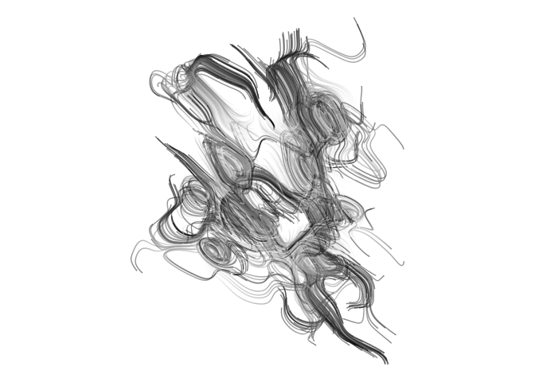

<!-- README.md is generated from README.Rmd. Please edit that file -->

# scrawl

<!-- badges: start -->

<!-- badges: end -->

## Example

``` r
library(scrawl)

dat <- scrawl_build(n_steps = 100)  
pic <- scrawl_plot(dat)

plot(pic)
```


